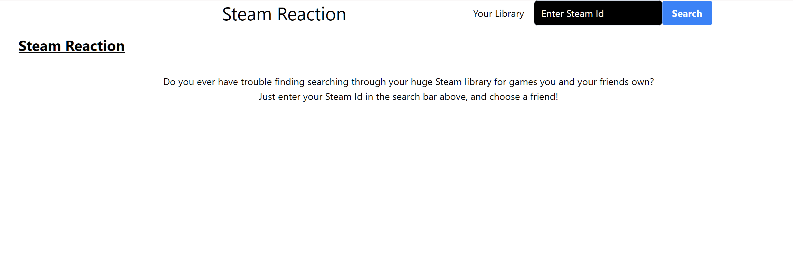
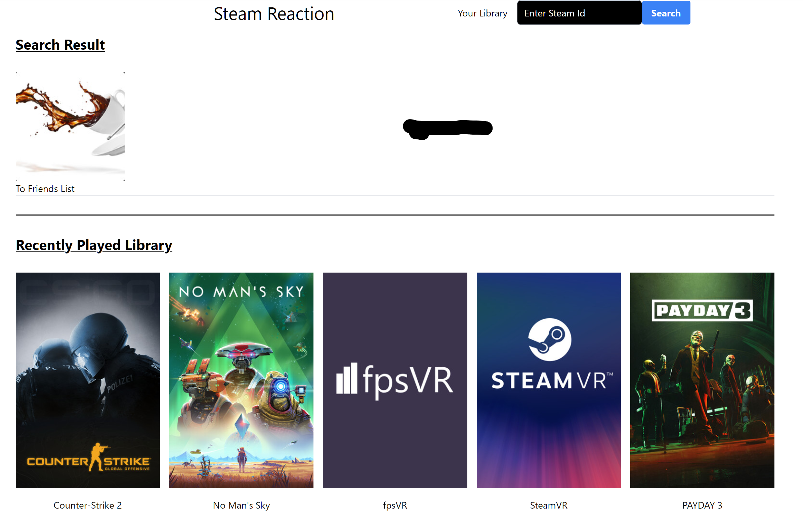
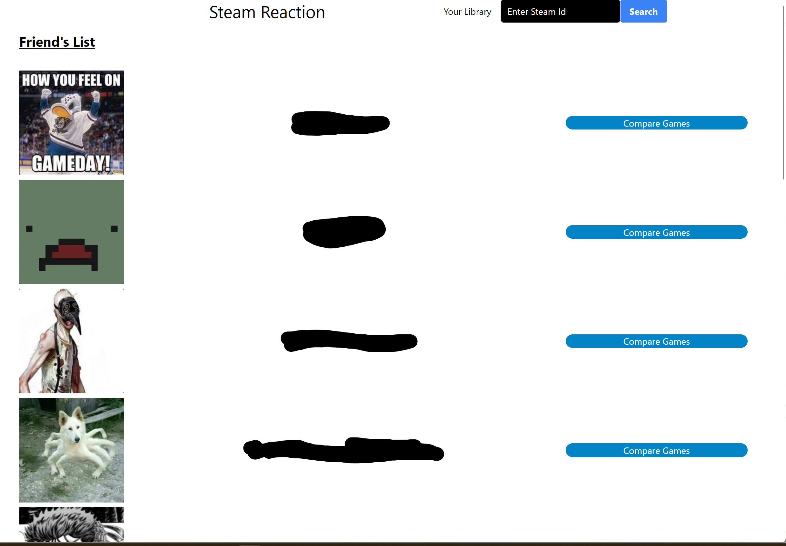
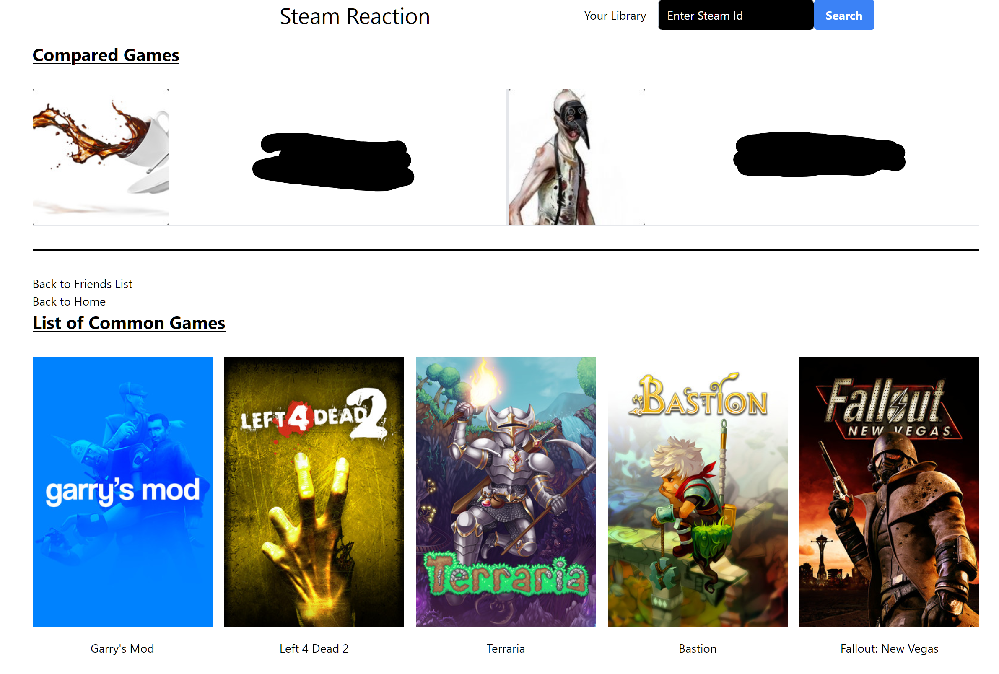

# steam-reaction

## Description
This web app uses the Steam Web API to the user to:

1. Search for their Steam ID (e.g. "76561197960435530")

2. Display Profile and Recently Played Games

3. Get their friends list

4. Get a list of common games that you and one other friend both own.

## Built with:
- [Gatsby](https://www.gatsbyjs.com/)
- [React](https://reactjs.org/)
- [TypeScript](https://www.typescriptlang.org/)
- [Tailwind](https://tailwindcss.com/)

## Get Started Locally
1. Get a Steam Web API Key under "Obtaining an Steam Web API Key"  [https://steamcommunity.com/dev](https://steamcommunity.com/dev)
2. Clone `steam-reaction` to local environment
3. Paste your Steam Web API key into the "example_.env" file
4. Rename "example_.env" to ".env"
5. Open a terminal in the local repository, enter `npm i` or `npm install`
6. Run `npm run dev` to start front-end
7. Run `npm start` to start back-end
8. Open `localhost:8000/` in a browser.
9. Enter the Steam ID you want in the Searchbar

## Current Limitations
- Some data may not be accessible depending on the Steam Privacy settings each user has.
- Friend's List is not sortable
- List of games in both "Recently Played Games" and "List of Common Games" is not sortable
- Some Steam games do not have hero capsule images and will only display titles

## License
MIT License